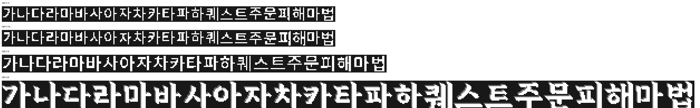

# Might and Magic 6·7·8 Merge 한국어 패치

Might and Magic 8 기반의 **Might and Magic 6·7·8 Merge**용 한국어 번역 패치입니다.



## 설치

1. [Releases](https://github.com/munument1/MMMerge-Korean/releases)에서 최신 ZIP을 받습니다.
2. 압축 안의 `Data`, `DataFiles`, `Scripts` 폴더를 Might and Magic 8 Merge 설치 폴더에 덮어씁니다.
3. 기본 GOG 설치 예시는 `D:\GOG\Might and Magic 8`입니다.
4. 기존 파일을 교체할지 묻는 경우 덮어쓰기를 선택합니다.

설치 후 다음 파일이 있어야 합니다.

```text
Might and Magic 8\
├─ Data\
│  ├─ LocalizeConf.ini
│  ├─ zz LocKO.T.lod
│  └─ Text localization\
│     ├─ KO_NPCText.txt
│     ├─ KO_NPCNames.txt
│     ├─ KO_NPCProfessions.txt
│     ├─ KO_GlobalTxt.txt
│     └─ KO_SpellsTxt.txt
├─ DataFiles\
└─ Scripts\General\
   ├─ KoreanFont.lua
   ├─ KoreanRuntimeFixes.lua
   ├─ LocalizeSignposts.lua
   └─ LocalizeTables.lua
```

## v1.0.4 폰트 변경

- 14·15·16픽셀의 작은 UI 글씨를 프리텐다드 SemiBold로 교체했습니다.
- 프리텐다드와 보존 문장부호에서 기존 그림자 픽셀을 모두 제거했습니다.
- 29픽셀의 서적·큰 글씨를 충주김생체로 교체했습니다.
- EUC-KR 완성형 한글 전체를 생성해 번역 텍스트에서 사용하는 DBCS 문자 1,296자에 누락이 없습니다.
- 깨진 저장 슬롯 제목은 해당 맵의 영문 이름으로 자동 복구됩니다. 수정 전 저장파일은 같은 폴더에 `.ko-title-backup` 확장자로 한 번 백업됩니다.
- `New Sorpigal`을 포함한 표지판 지명을 지도 스크립트가 힌트를 복사하기 전과 후에 모두 번역합니다.
- 폰트 출처와 이용 조건은 [FONT_LICENSES.md](FONT_LICENSES.md)를 참고하십시오.

## v1.0.3 추가 수정

- 일부 표지판과 지역 방향 안내를 한국어로 표시합니다.
- 일반 NPC 직업 77개를 번역했습니다.
- NPC 이름 표시를 `이름 - 직업` 형식으로 바꿔 영어 관사 `The`가 섞이지 않게 했습니다.
- 시스템 문자열 758개를 보완했습니다.
- `좋은 day입니다!`의 원인이던 `morning/day/evening` 치환값을 `아침/하루/저녁`으로 수정했습니다.

## v1.0.2 교정 사항

- 사용자가 제공한 `KO_NPCText`, `KO_NPCGreet1`, `KO_NPCGreet2`를 바이트 그대로 복원했습니다.
- 폐기된 `Scripts\General\History.lua`를 제거했습니다.
- v1.0 또는 잘못 게시된 v1.0.1에서 업데이트했다면 게임 폴더의 기존 `Scripts\General\History.lua`도 직접 삭제해야 합니다.

## v1.0.1 주요 수정

- 누락되거나 영어로 남아 있던 NPC 대화와 인사말을 완성된 번역본으로 교체했습니다.
- 무작위 NPC 이름 남성 539개·여성 310개를 한국어로 표시합니다.
- 주문 132종의 이름, 설명, 일반/전문가/마스터/그랜드마스터 효과를 번역했습니다.
- 여러 줄로 분리된 대화가 첫 줄만 표시되던 로더 문제를 수정했습니다.
- NPC 이름 번역을 읽을 때 발생하던 다중 반환값 오류와 영어 이름 배열이 남는 문제를 수정했습니다.

## 인코딩

번역 텍스트는 게임 로더에 맞춘 CP949(EUC-KR 호환) 형식입니다. 텍스트 파일을 수정할 때 UTF-8로 저장하지 마십시오.

## 검증

v1.0.4는 다음 항목을 확인했습니다.

- 대화 2,713개 ID와 서식 토큰 보존
- 무작위 NPC 이름 남성 539개·여성 310개 런타임 적용
- 주문명 132개 런타임 적용
- 일반 NPC 직업 77개 런타임 적용
- 시스템 문자열 758개 및 서식 토큰 검사
- DBCS 폰트 104개 구조 및 런타임 로딩 검사
- 작은 UI 폰트 78개의 그림자 픽셀 부재 검사
- 저장파일 `header.bin` 제목 복구와 백업 생성 검사
- 지도 이벤트 문자열·힌트의 `New Sorpigal` 지명 변환 검사
- CP949 디코딩 및 테이블 행 구조 검사
- MMExtension 번역 로더 오류 없음

자세한 변경 사항은 [CHANGELOG.md](CHANGELOG.md)를 참고하십시오.
